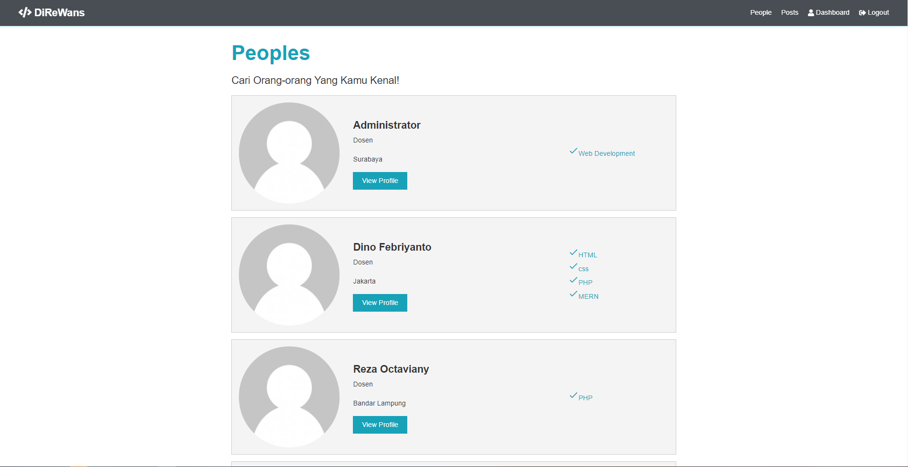
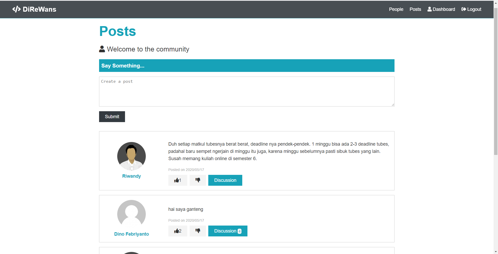
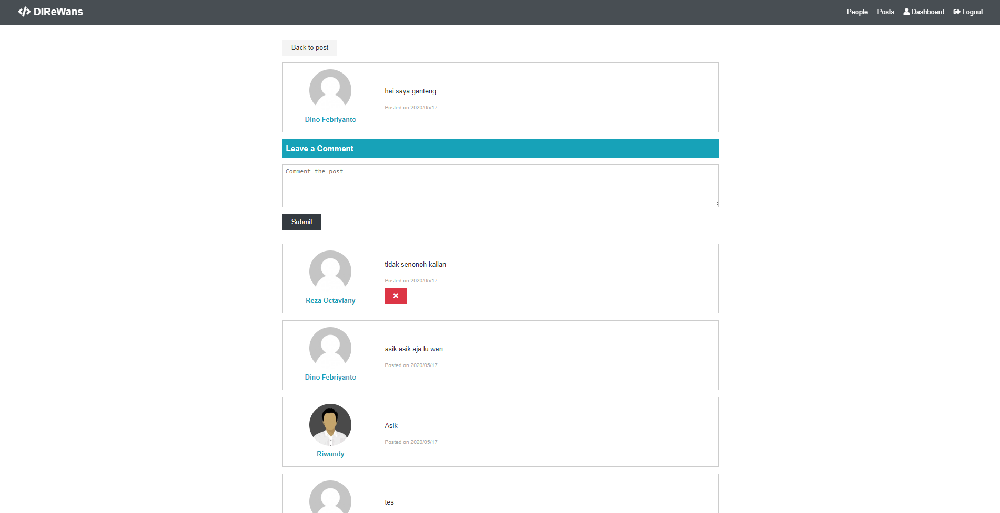

# DIREWAN
# SOCIAL MEDIA UNTUK INFORMATIKA ITERA

Social media ini dibuat oleh:
- 14117124	DINO FEBRIYANTO as [alien087](https://github.com/alien087)
- 14117098	RIWANDY as [riwandys](https://github.com/riwandys)
- 14117062	REZA OCTAVIANY as [recchan13](https://github.com/recchan13)

## TUTORIAL INSTALASI
1. Clone apps dari github ini, dengan branch 1.0 [ini](https://github.com/riwandys/direwan/tree/1%2C0)
2. Instal nodemon concurrently `npm i -D nodemon concurrently` 
3. jalankan server dan front-end program dengan `npm run dev`

![tes][devconnector_html_theme/img/icon.png)

